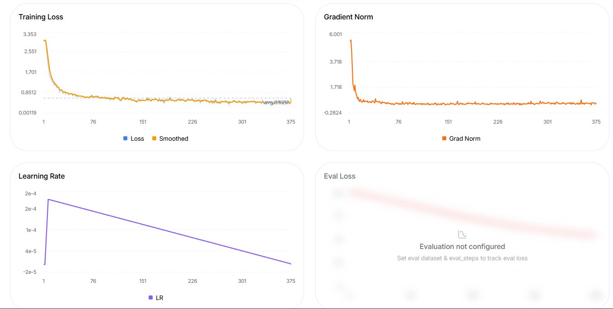
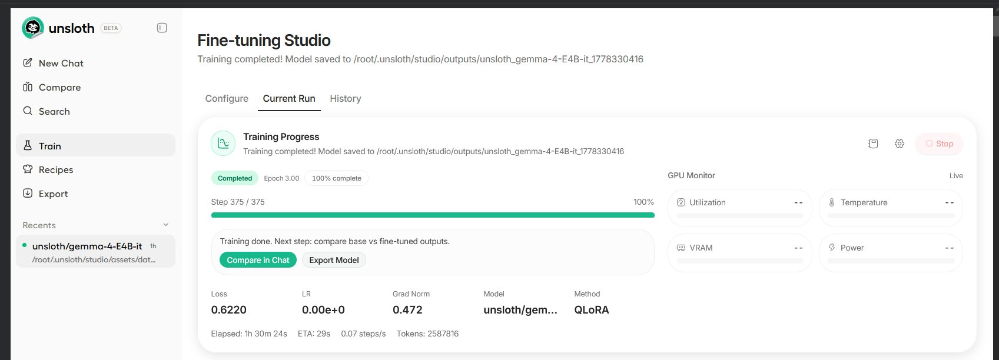

# 🛠️ Technical Documentation — pediatric-support-g4 v0.1

> For project vision, SDG alignment, and international context see [`BACKGROUND.md`](BACKGROUND.md).
> For project status and disclaimer see [`README.md`](README.md).

---

## 📊 What This Run Validated

This iteration used a subset of the MedMCQA dataset (pediatric subjects) to confirm the following before committing to full-scale clinical fine-tuning:

| Validation Target | Result |
|---|---|
| Pipeline runs end-to-end on Gemma 4 E4B + QLoRA | ✅ Confirmed |
| Loss convergence is stable (no divergence or instability) | ✅ Confirmed |
| Gradient norms remain controlled throughout training | ✅ Confirmed |
| Hyperparameter configuration is viable for future runs | ✅ Confirmed |
| Clinical reasoning performance | ⚪ Not evaluated — out of scope for v0.1 |
| Generalization to unseen cases | ⚪ Not evaluated — out of scope for v0.1 |

---

## 🗂️ Dataset: Why MedMCQA

MedMCQA is a large-scale, openly available medical question answering dataset derived from AIIMS and NEET-PG medical entrance examinations, covering 21 medical subjects including pediatrics.

It was selected for this pipeline validation run for two practical reasons. First, **it eliminates all data engineering overhead**: MedMCQA comes pre-split into training, validation, and test sets, with clearly labeled subject categories, allowing immediate filtering of pediatric-relevant questions without any additional curation work. Second, **it is in English**, which reduced an additional source of complexity for a validation run where the goal was to confirm infrastructure stability, not language generalisation — Gemma 4 E4B's base training is predominantly English, making the fine-tuning signal cleaner for this purpose.

For a pipeline validation run, this is the right choice — the goal was to confirm the training infrastructure works with domain-relevant medical data, not to build the production dataset. The pediatric subset provided sufficient clinical signal to validate that the base model responds correctly to domain fine-tuning.

MedMCQA is not the intended long-term data source for this project. No equivalent dataset covering the tropical and endemic pediatric disease profile of the Americas has been found. Future iterations will address this directly, pivoting to Spanish-language clinical datasets aligned with the project's geographic and epidemiological scope.

---

## 🏗️ Architecture Choice: Gemma 4 E4B over MedGemma 1.5 4B

The primary alternative considered was **MedGemma 1.5 4B** [1], the latest model in Google DeepMind's MedGemma collection (arXiv:2604.05081v2, May 2026). MedGemma 1.5 4B is the only updated model in this release — the MedGemma 27B remains available but was not updated and is not size-equivalent for this comparison. MedGemma 1.5 4B is designed for developers building healthcare AI applications and supports fine-tuning via LoRA and reinforcement learning. However, for the specific scope and deployment requirements of this project, Gemma 4 E4B [2] is the stronger foundation. The rationale rests on three arguments.

### Comparison

| Dimension | MedGemma 1.5 4B | Gemma 4 E4B |
|---|---|---|
| Base architecture | Gemma 3 | Gemma 4 (one generation newer) |
| Medical knowledge | Extensive out-of-the-box | Requires targeted fine-tuning |
| Thinking mode | ⚠️ Available via prompted system instruction | ✅ Natively integrated via dedicated architecture token |
| Vision training focus | Hospital-grade diagnostics (chest X-ray, 3D CT/MRI volumes, whole slide pathology, dermoscopy, ophthalmology) | General purpose |
| Mobile / on-device optimisation | Not designed for mobile — expanded 3D imaging capabilities require substantial compute infrastructure | ✅ Purpose-built for on-device deployment on smartphones and laptops |
| Alignment control | Fixed by Google's training choices | ✅ Full control via fine-tuning |

### Why Gemma 4 E4B

**Thinking mode.** Gemma 4 introduces extended chain-of-thought reasoning — the model produces explicit, traceable reasoning chains before committing to a response. For clinical decision support, this is clinically meaningful: it allows the specialist to follow and evaluate the model's reasoning process rather than receiving an opaque conclusion. MedGemma 1.5 4B activates thinking via a prompted system instruction appended at inference time — it is not natively integrated into the architecture. Gemma 4 E4B, by contrast, controls thinking via a dedicated `<|think|>` token built into the model from the ground up, making it a first-class architectural capability rather than a prompted behaviour.

**Mobile-first deployment.** The realistic deployment target for this project is a clinician's smartphone in a remote field setting, not a server or a laptop. Gemma 4 E4B is purpose-built for this: the E2B and E4B models are specifically designed for efficient local execution on mobile devices [2]. MedGemma 1.5 4B makes no equivalent claim about mobile optimisation, and its expanded capabilities — processing 3D CT/MRI volumes of up to 85 axial slices (21,760 vision tokens) and whole slide pathology images of up to 126 patches (32,256 vision tokens) per query [1] — might not be fully leveraged on a smartphone, especially in remote and isolated field settings. Furthermore, Google's own recommended production deployment path for MedGemma 1.5 4B points explicitly to cloud infrastructure: Model Garden and Google Cloud Storage, with specialised server-side processing for large medical images [1]. Gemma 4 E4B, by contrast, was explicitly designed for efficient execution on everyday devices such as smartphones [2]. Research from Stanford University's Mussallem Center for Biodesign confirms that deploying LLMs on mobile devices for clinical reasoning is technically feasible, with memory constraints — not raw processing power — being the primary limitation, and that compact models achieve a strong balance between speed and clinical accuracy on everyday smartphone hardware [3].

**No meaningful head start for this clinical scope.** MedGemma 1.5 4B's medical pre-training is an asset for general hospital-based clinical tasks. However, its visual training reflects hospital-grade imaging modalities: chest X-ray, 3D radiology (CT and MRI volumes), whole slide histopathology, dermoscopy under controlled clinical conditions, and ophthalmology [1]. The target use case of this project — tropical and endemic pediatric diseases diagnosed in field settings — requires a fundamentally different diagnostic profile. Conditions such as cutaneous leishmaniasis, severe dengue presentations, Chagas disease, and Oropouche fever in children simply do not appear in MedGemma 1.5 4B's training distribution. Both MedGemma 1.5 4B and Gemma 4 would require targeted fine-tuning on curated field-relevant data to cover this scope; neither has a meaningful head start. Given that, Gemma 4's newer architecture with native reasoning capability and mobile optimisation is the stronger foundation for this project.

---

## 📈 Training Results

Trained using **[Unsloth Studio](https://unsloth.ai)**.

### Configuration

| Parameter | Value |
|---|---|
| Base Model | `unsloth/gemma-4-e4b-it-unsloth-bnb-4bit` |
| Dataset | MedMCQA — pediatric subjects subset |
| Method | QLoRA (Quantized Low-Rank Adaptation) |
| Epochs | 3 |
| Total Steps | 375 |
| Batch Size | 4 |
| Context Length | 768 tokens |
| Optimizer | AdamW 8-bit |
| Learning Rate | 2e-4 (cosine decay, 5 warmup steps) |
| LoRA Rank | 16 |
| LoRA Alpha | 32 |
| LoRA Dropout | 0.05 |
| Total Tokens Seen | ~2,587,816 |
| Training Duration | ~1h 30m |

### Training Dynamics

The charts confirm healthy pipeline behavior throughout the run:

- **Training Loss** dropped sharply from ~3.35 in the first 50 steps, then stabilized cleanly around an average of 0.6211 with no divergence or anomalous spikes.
- **Gradient Norm** showed a single expected spike at initialization (~6.0), then stabilized around ~0.5 from step 50 onward — confirming numerical stability throughout.
- **Learning Rate** followed the cosine decay schedule correctly, completing at near-zero by step 375.
- **Evaluation loss** was not configured for this run. Validation metrics are scoped for the next iteration.



### Final Run Summary

| Metric | Value |
|---|---|
| Final Loss | 0.6220 |
| Final Grad Norm | 0.472 |
| Total Tokens | 2,587,816 |
| Duration | 1h 30m 24s |



---

## 🛠️ Usage

This is a **LoRA adapter** — it must be loaded alongside its base model.

### Installation

```bash
pip install transformers peft bitsandbytes accelerate
```

### Loading the Model

```python
from transformers import AutoModelForCausalLM, AutoTokenizer
from peft import PeftModel

base_model_id = "unsloth/gemma-4-e4b-it-unsloth-bnb-4bit"
adapter_id    = "albertoanalytics/pediatric-support-g4-v1"

tokenizer = AutoTokenizer.from_pretrained(base_model_id)

model = AutoModelForCausalLM.from_pretrained(
    base_model_id,
    load_in_4bit=True,
    device_map="auto",
)
model = PeftModel.from_pretrained(model, adapter_id)
model.eval()
```

### Inference Example

```python
import torch

prompt = """You are a knowledgeable pediatric medicine assistant.
A 3-year-old presents with a barking cough, stridor at rest, and low-grade fever.
What is the most likely diagnosis and recommended first-line management?"""

inputs = tokenizer(prompt, return_tensors="pt").to(model.device)

with torch.no_grad():
    outputs = model.generate(
        **inputs,
        max_new_tokens=512,
        temperature=0.7,
        do_sample=True,
    )

print(tokenizer.decode(outputs[0], skip_special_tokens=True))
```

---

## 🗺️ Roadmap

| Version | Scope | Compute Requirement |
|---|---|---|
| ✅ v0.1 | Pipeline validation using MedMCQA pediatric subset | Minimal |
| v0.2 | Fine-tuning on Spanish-language Latin American clinical datasets (e.g. PeruMedQA as an Andean starting point) + expansion toward pan-regional tropical and endemic pediatric disease coverage + first accuracy benchmarks on smartphone inference | Moderate |
| v0.3 | Expanded clinical coverage + clinical expert review of outputs | Moderate |
| v0.4 | Quantized GGUF export for llama.cpp / mobile deployment | Low |
| v1.0 | Red-teaming, safety evaluation, and independent clinical validation | — |

---

## 📚 References

> The full reference list including all international and institutional sources is in [`BACKGROUND.md`](BACKGROUND.md).

[1] Google DeepMind. *MedGemma.* Google Health AI Developer Foundations. https://developers.google.com/health-ai-developer-foundations/medgemma — Google Research and Google DeepMind. (2026). *MedGemma 1.5 Technical Report.* arXiv:2604.05081v2. https://arxiv.org/abs/2604.05081v2

[2] Google DeepMind. *Gemma 4 Model Card.* https://ai.google.dev/gemma/docs/core/model_card_4

[3] Nissen, L. et al. (2025). *Medicine on the Edge: Comparative Performance Analysis of On-Device LLMs for Clinical Reasoning.* Stanford University / University Hospital Bonn. arXiv:2502.08954. https://arxiv.org/abs/2502.08954
